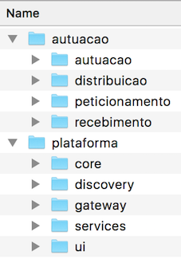
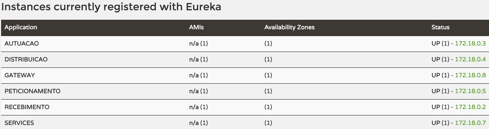
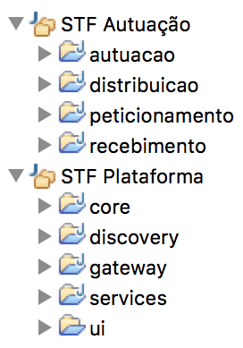

## Comece a trabalhar no STF Digital
O tutorial abaixo foi criado para o Sistema Operacional Windows. Alguns passos foram documentados também para Linux. Caso encontre alguma dificuldade, entre em contato com Rodrigo Barreiros no e-mail rodrigo.barreiros@stf.jus.br.

### Baixe a IDE recomendada: Spring Tool Suite
Baixe o <a target="_blank" href="https://spring.io/tools">Eclipse STS (Spring Tool Suite)</a>. Enquanto o download é realizado, continue configurando o ambiente...

### Baixe o Repositório e o Docker para montar o ambiente

##### Instale o Docker Toolbox com Git e VirtualBox
Instale o <a target="_blank" href="https://www.docker.com/products/docker-toolbox">Docker ToolBox 1.11.1+</a>. 

##### Baixe o repositório
Abra o <b>Docker Quickstart Terminal</b> e na sua pasta de preferência (ex: /c/dev) , para baixar o repositório e execute os comandos abaixo:

    $ git clone https://github.com/supremotribunalfederal/stfdigital.git
    $ cd stfdigital
    $ ./clone-all.sh
    
Isso deve resultar na seguinte estrutura de diretórios:

##### Instale o Gradle
Cada componente deverá ser construído separadamente, portanto cada um tem seu próprio arquivo de construção. Usamos Gradle como ferramenta de montagem, então você precisa instalá-lo antes de prosseguir. 

<a target="_blank" href="http://gradle.org/gradle-download/">Baixe o binário do Gradle</a> e extraia o zip para o diretório de sua preferência. Adicione o diretório bin (SeuDiretorioGradle\gradle-2.13\bin) na variável de ambiente "Path" do seu sistema operacional.

Para configurar a variável de ambiente no windows clique com o botão direito em Meu Computador > Propriedades > Configurações avançadas do sistema > Variáveis de Ambiente > Clique duas vezes em Path e inclua ";SeuDiretorioGradle\gradle-2.13\bin". Depois clique em OK.

##### Atualize o Virtual Box
Apesar da instalação do Virtual Box com o Docker ToolBox, recomendamos sua atualização para a versão mais recente (5.0.20+) em:  <a target="_blank" href="https://www.virtualbox.org/wiki/Downloads">Baixar Virtual Box</a>.

Execute o Docker Quick Start Terminal como administrador para executar a máquina virtual. Ele criará as interfaces de redes virtuais.

Pare a máquina virtual com o seguinte comando: `docker-machine stop default`. Abra o Virtual Box clique com o botão direito na máquina virtual <i>default</i>, clique em configurações > Sistema > Aumente a Memória Base para 3GB (3072MB). Esse passo é importante por rodarmos mais de 10 containers simultâneos. Feche e abra o Docker Quickstart novamente para aplicar as alterações e levantar a máquina novamente.

##### Configure seus hosts

Para facilitar o acesso a <i>Docker Machine</i>, relacione seu IP ao alias "docker". Para identificar o IP da <i>Docker Machine</i>, execute o comando abaixo:

    $ docker-machine ip
    Copie o endereço de IP e

No Windows, abra o arquivo 
    
    C:\Windows\System32\drivers\etc\hosts

E adicione as linhas abaixo:

    192.168.99.100  docker
    192.168.99.100  rabbit
    192.168.99.100  discovery
    192.168.99.100  documents
    192.168.99.100  gateway 
    192.168.99.100  services    
    192.168.99.100  ui  
    192.168.99.100  mongo       

No Linux, isso pode ser feito adicionando uma entrada no arquivo `/etc/hosts`, como no exemplo abaixo 

    192.168.99.100  docker
    192.168.99.100  rabbit
    192.168.99.100  discovery
    192.168.99.100  documents
    192.168.99.100  gateway 
    192.168.99.100  services    
    192.168.99.100  ui  
    192.168.99.100  mongo       

Você poderá confirmar se esse relacionamento está funcional executando o comando `ping` contra o alias criado.

    $ ping docker
    PING docker (192.168.99.100): 56 data bytes
    64 bytes from 192.168.99.100: icmp_seq=0 ttl=64 time=0.314 ms
    64 bytes from 192.168.99.100: icmp_seq=1 ttl=64 time=0.340 ms
    64 bytes from 192.168.99.100: icmp_seq=2 ttl=64 time=0.386 ms

#### Instale o JAVA JDK 8

Digite javac -version e caso não tenha instalado, baixe o <a target="_blank" href="http://www.oracle.com/technetwork/pt/java/javase/downloads/jdk8-downloads-2133151.html">Java JDK 8</a> e instale.

Crie uma nova variável de ambiente chamada JAVA_HOME com o endereço da instalação do JDK (ex: C:\Program Files\Java\jdk1.8.0_91)
Adicione na variável Path ";%JAVA_HOME%\bin"

Execute o comando javac - version para verficar se a instalação foi realizada com sucesso.
Feche e abra o Docker Quickstart Terminal novamente.

#### Instale o Node e o NPM
Você também precisará ter a versão mais recente do  <a href="https://nodejs.org/dist/v5.9.1/" target="_blank">NodeJS 5.9  (já inclui NPM)</a>. Sugerimos 5.9.1+. Não baixe versão superior a NodeJS 6+, ela ainda não foi testada.

Após instalar o NodeJs, feche e abra novamente o Docker QuickStart Terminal (para recuperar as novas variáveis de ambiente).
Para verificar se o NodeJS e o NPM estão instalados corretamente, execute os comandos: 

    node -v
    npm -v
    
### Instale o Gulp

Execute o seguinte comando para instalar o gulp globalmente:

$ npm install -g gulp

#### Instale o Maven (opcional)
O Maven ainda não é necessário nesse passo, mas você pode baixá-lo em <a href="https://maven.apache.org/download.cgi" target="_blank">Maven</a>. Ele deverá ser configurado adequadamente para que o Gradle reutilize as bibliotecas já existentes em seu repositório local. Falaremos sobre esse passo mais adiante.

#### Execute o Script Gralde

Para facilitar o processo, temos um pequeno script que pode ser usado para construir todos os componentes de uma vez.  

Agora podemos rodar o script de construção do ambiente. Entre no diretório que clonou o ambiente e execute o comando abaixo:

    $ ./build-all.sh

A execução do script Gradle termina com a geração da imagem docker de cada componente. 

`Vá tomar um café! Esse passo demora mesmo!` 

Isso deverá resultar em <b>sete mensagens</b> iguais a mensagem de log abaixo:

    BUILD SUCCESSFUL
    
Neste ponto, todas as imagens docker já foram geradas.

Execute o comando

    $ docker images

E veja o resultado abaixo:

    REPOSITORY                   TAG                 IMAGE ID            CREATED             SIZE
    plataforma-ui                latest              234234aef342        10 hours ago        239.3 MB           
    documents                    latest              40f233ae82fb        10 hours ago        367 MB    
    services                     latest              407ae34482fb        10 hours ago        326.2 MB
    gateway                      latest              dafb856acb19        10 hours ago        241.1 MB
    discovery                    latest              cd91ba415aa7        10 hours ago        260.5 MB
    distribuicao                 latest              16645d77429b        10 hours ago        325.8 MB
    autuacao                     latest              e072d2c45d2e        10 hours ago        325.8 MB
    recebimento                  latest              89f185501e17        10 hours ago        325.9 MB
    peticionamento               latest              eb5ada3f8d4c        10 hours ago        325.8 MB
    frolvlad/alpine-oraclejdk8   slim                a7754f3b301e        7 days ago          167.4 MB

#### Pronto! Execute a aplicação!

Você poderá rodar todas elas de uma única vez usando <i>Docker Compose</i>: 

    $ docker-compose up -d

#### Acompanhe os logs com Kitematic

Abra o Kitematic ou acompanhe as mensagens de log pelo comando: 

    $ docker-compose logs
    
A medida que os serviços forem iniciados, eles serão registrados automaticamente no serviço de discovery. Acesse `http://docker:8761` para acompanhar o registro dos serviços. Quando todos estiverem registrados, você deverá ver a tabela como no exemplo abaixo:

#### Para trabalhar com UI...

Rode no diretório plataforma/ui os comandos abaixo e pare o container de UI pelo Kitematic

    npm install
    gulp serve

    
### Configure o Eclipse para começar a codificar

Usamos <a target="_blank" href="https://spring.io/tools">Eclipse STS</a> como IDE. Certifique-se que você tem a última versão. 
Você também precisará instalar os seguintes plugins:

    > Gradle IDE Pack 3.7.x+1.0.x
    > Typescript.java

#### Instalando o plugin do Gradle para Eclipse

Para baixar o plugin do Gradle siga os passos abaixo:

    abra o Eclipse, 
    clique em Help 
    "Eclipse Market Place". Procure o plugin e clique em instalar. Next, Next, Finish.

#### Instalando o reconhecimento da sintaxe do Typescript

`A instalação do typescript.java não funcionou`

Para instalar o reconhecimento da sintaxe do Typescript <a href="https://github.com/angelozerr/typescript.java/wiki/Installation%20Update%20Site" target="_blank">Typescript.java</a> siga os passos abaixo:

    Abra o Eclipse > clique em Help > Install New Software... > ADD.

    Inclua em location site o link do typescript.java "http://oss.opensagres.fr/typescript.ide/1.0.0-SNAPSHOT/". O nome pode ser Typescript.java Update site.

    Marque todas as opções e clique em Next, Next, Finish.

`A instalação do typescript.java não funcionou`

#### Importando os projetos no Eclipse

Você vai precisar importar todos os componentes separadamente. Você pode importar cada projeto diretamente pelo Eclipse, como um Projeto Gradle, ou pode executar o comando abaixo, no diretório de cada projeto, para gerar os arquivos necessários antes de importá-lo como um projeto já existente. 

##### Digitando o comando (substitui o próximo passo)

Abra o <b>Git Bash</b> e na raiz do STF Digital, para gerar os arquivos de importação do eclipse, digite:

    $ ./import-all.sh

    Ou rode manualmente o comando abaixo em cada pasta que deseja trabalhar:
    
    $ gradle eclipse

Após rodar o comando, um arquivo chamado .project e uma pasta .settings serão criados permitindo importação do projeto no eclipse. Para importar siga os passos abaixo:

    > Clique com o botão direito na view Package Explorer
    > Clique em Import
    > Clique em General > Existing Projects into Workspace
    > Selecione o diretório em que você rodou o comando "gradle eclipse"

Repita os passos para cada um dos componentes.

##### Usando apenas o Eclipse (substitui o passo anterior)

    > Clique com o botão direito na view Package Explorer
    > Clique em Import
    > Clique em Gradle (STS) - aparecerá se o plugin Gradle estiver instalado corretamente
    > Clique em Gradle (STS) Project
    > Clique em Browse
    > Selecione o diretório do projeto (ex: stfdigital/autuacao/recebimento)
    > clique em Build Model `é normal demorar na primeira execução`

#### Organizando os projetos nos Working Sets "Área de Negócio" e "Plataforma"

Se optar por uma organização com <i>Working Sets</i>, você deverá ter uma estrutura de projetos como na imagem abaixo:

    

    > Clique com o botão direito no nome do projeto
    > Assign Working Sets
    > Selecione Autuação ou Plataforma, por exemplo
    > No cabeçalho da view Package Explorer, clique na seta para baixo
    > Top Level Elements > Working Set

##### Desenvolvendo local

Para viabilizar o desenvolvimento local usando as imagens docker, usamos o <i>Spring Devtools</i>, que permite o `hot restart` de aplicações <i>Spring Boot</i> rodando dentro de um container docker. Os serviços da plataforma já estão configurados para viabilizar tal funcionalidade. No Eclipse, basta executar a sequência abaixo:

    - Com o botão direito, clique no projeto "services"
    - Em seguida, clique em "Run As" -> "Sprint Devtools Client"
    - Em "Remote Url" informe "http://docker:8081"
    - Em "Remote Secret" informe "stfdigital"
    - Click em "Run"

Isso vai iniciar uma conexão remota com a imagem docker correspondente. No terminal, acesse o log do container pelo comando:
 
    $ docker-compose logs services
    
Faça alguma alteração no arquivo "ProcessoRestResource" (por exemplo, altere de "Publicado" para "Distribuído"). Assim que você salvar o arquivo, as mensagens de log do restart devem começar a ser exibidas no terminal. Após concluído o restart, acesse o browser para confirmar se a label da tabela de pesquisa foi realmente alterada, de "Publicado" para "Distribuído".

Para realizar o debug, bastar acessar a mesma configuração usada acima, mas em modo Debug. Para confirmar, coloque um break point no arquivo "ProcessoRestResource" e acesse novamente a funcionalidade de pesquisa.

Para finalizar todos os serviços, basta executar o comando abaixo:
 
    $ docker-compose down